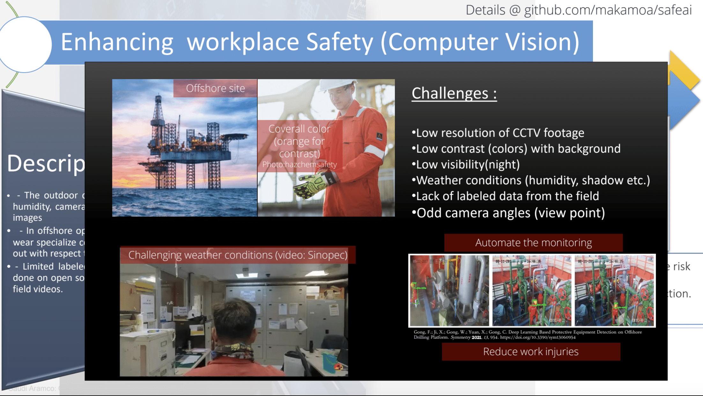
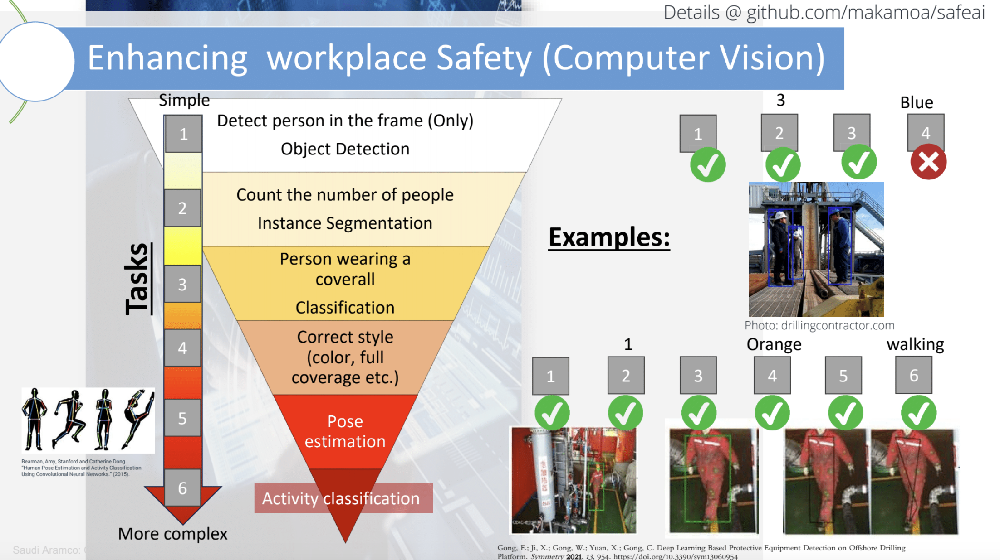

# Task





Hi guys. Here is the summary of everything i found so far, as well as ideas for potential solutions.

_______________________________________________________________________________________________________________________________________  

**1. The extensive literature review**  
https://link.springer.com/article/10.1007/s10462-024-10978-x  

**2. The paper from this literature review with one of the best results**  
https://www.sciencedirect.com/science/article/pii/S0925753521004860  

**3. Available training datasets can be found here**   
https://arxiv.org/pdf/2407.04590

**4. The website with the videos we can use to test the performance**  
https://www.pexels.com/search/videos/construction%20worker/

**5. The YOLO model. The most convenient and efficient model (fast ingerence) for me so far for Object Detection and Pose Estimation**  
https://github.com/ultralytics/ultralytics  

_______________________________________________________________________________________________________________________________________

Seems that here we have 2 types of problems:  
1. The basic problem. Incudes  
   1.1. Detect person in frame  
   1.2. Count the number  of peole  
   1.3. What person is wearing - on the offshore drilling rig, the PPE are the helmer, glasses, gloves, boots, and coverall  
   1.4. Correct style of PPE - like the color and the proper usage  
   1.5. Pose estimation  
   1.6. Activity classification  
2. The advanced problem:  
   2.1.  Low resolution of CCTV footage  
   2.2. Low contrast (colors) with background  
   2.3. Low visibility (night)  
   2.4. Weather conditions (humidity, shadow)  
   2.5. Lack of labeled data from the fiels  
   2.6. Odd camera angles (view point)  

As i see it, we need to solve the basic problems first, test them, and make sure it works fine, and only then handle the advanced problems (you are welcome to suggest different options).  

For the basic problems, so far i can see 4 potential solutions:  
Solution 1:  
This workflow was described in https://www.sciencedirect.com/science/article/pii/S0925753521004860  
1. Pose estimation
2. Based on the neckpoints from the pose estimation, calculate the bbox for hands, legs, head, and upper body
3. Crop these bbox and send to the classifier
4. Predict if the bbox has any PPE or not
   This solution requires pretraining for the classifier

Solution 2:  
This workflow was described in [https://www.sciencedirect.com/science/article/pii/S0925753521004860  ](https://arxiv.org/pdf/2407.04590)  
1. Take the YOLO model
2. Take the custom dataset
3. Fine-tune the YOLO model with the custom dataset

In this work, the fine-tuning was already done, and the trained model was published. I tested it, and it can identify the head, hands, ears, and face good, but the estimation of PPE is not very good  

Solution 3:  


First, i installed the latest Pytorch as follows  
```
conda install pytorch torchvision torchaudio pytorch-cuda=11.8 -c pytorch -c nvidia
```
Next, i installed the model and cv2 library as follows

```
pip install ultralytics opencv-python-headless
```

To run the code, run
```
python3 HAK.py -d
```

 So far, i used yolo11n.pt because it is the lighest model. There are different options which we can find on the website.

 

 The code and the video example is attached
